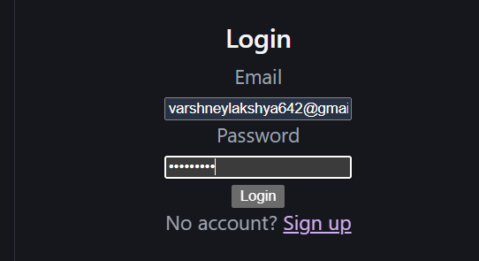
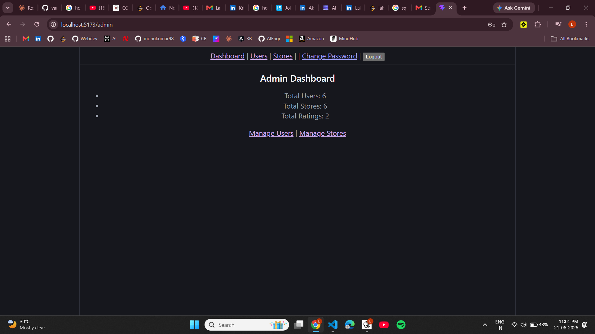
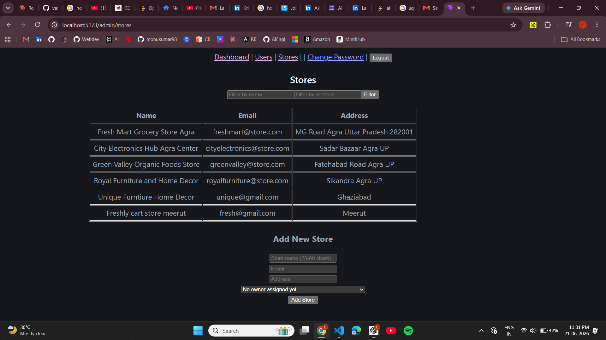
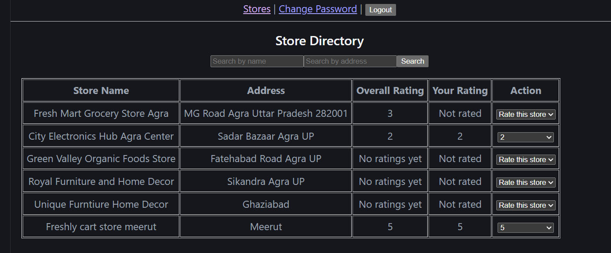

# Store Rating Platform

Full-stack coding challenge submission for the Roxiler Systems FullStack Intern role.

A web app where users can browse registered stores and submit ratings (1-5). Three roles — System Administrator, Normal User, and Store Owner — each get a different experience after login.

## Tech Stack

- **Backend:** NestJS, TypeORM, PostgreSQL
- **Frontend:** React (Vite), React Router, Axios
- **Auth:** JWT with bcrypt password hashing
- **Validation:** class-validator (backend), inline form validation (frontend)

## Why these choices

- **NestJS over Express** — the module system kept auth, users, stores, and ratings genuinely isolated. Decorators also cleaned up the role-guard logic significantly compared to writing middleware by hand.
- **TypeORM** — comfortable with it from prior projects. Prisma would give better type inference on relations, but the setup time for a 3-day build wasn't worth the switch.
- **UUID primary keys** — auto-increment IDs leak row counts. Not a strict requirement here, but a habit worth keeping.
- **Plain inline styles on the frontend** — given the timeline, the priority was a fully working, well-tested backend over frontend polish. No CSS framework was used; the UI is intentionally functional, not styled.

## Features

### System Administrator
- Dashboard with total users, stores, and ratings count
- Add new stores, normal users, and admin users
- Assign a store owner to a store at creation time
- View and filter all users/stores by Name, Email, Address, Role
- Sortable tables (ascending/descending) on all key columns

### Normal User
- Sign up and log in
- Browse all registered stores, search by name/address
- Submit a rating (1-5) for any store
- Update their previously submitted rating
- Change their own password

### Store Owner
- View their store's average rating
- View the list of users who rated their store
- Change their own password

## Project Structure

\\\
roxiler-store-rating/
├── backend/          NestJS API (auth, users, stores, ratings, admin, owner modules)
└── frontend/         React app (Vite)
\\\

## Setup

### Prerequisites
- Node.js 18+
- PostgreSQL running locally

### Backend

\\\ash
cd backend
npm install
cp .env.example .env   # fill in your DB credentials
npm run start:dev
\\\

Backend runs on \http://localhost:3000\.

### Frontend

\\\ash
cd frontend
npm install
npm run dev
\\\

Frontend runs on \http://localhost:5173\.

### Database

\\\sql
CREATE DATABASE store_ratings;
\\\

Tables are auto-created on first run via TypeORM's \synchronize: true\ (dev-only setting — would use migrations in production).

## Form Validations

| Field | Rule |
|---|---|
| Name | 20-60 characters |
| Address | Max 400 characters |
| Password | 8-16 characters, at least 1 uppercase, at least 1 special character |
| Email | Standard email format |
| Rating | Integer, 1-5 |

## Known edge cases handled

- **Average rating with zero ratings** — returns \
ull\, not \NaN\. The UI shows "No ratings yet" instead of a broken number.
- **Duplicate rating submission** — a user can't submit twice for the same store; backend returns 409 Conflict and the frontend automatically offers an update instead.
- **sortBy injection** — only whitelisted column names are allowed in \ORDER BY\ clauses, blocking arbitrary SQL injection through query params.
- **Role-based 401 vs 403** — 401 means not logged in, 403 means logged in but wrong role. Kept distinct on purpose.
- **Store owner with no linked store** — dashboard returns a clear "No store is linked to your account" message instead of crashing.

## What I'd improve with more time

- Pagination on all list endpoints (currently fetches all rows)
- Refresh token flow — JWTs currently just expire and force re-login
- Rate limiting on the rating submission endpoint
- Proper CSS/component library instead of inline styles
- Automated tests (the \.spec.ts\ files are NestJS CLI scaffolding, not filled in with real test cases)
- DB migrations instead of \synchronize: true\

## Known limitation

The original spec doesn't define a UI flow for linking a store to its owner. I added an "Assign Owner" dropdown on the admin's "Add Store" form, populated from existing \store_owner\ accounts, so this can be done through the UI rather than a manual database update.

## API Overview

| Method | Route | Access |
|---|---|---|
| POST | /auth/login | Public |
| POST | /users/signup | Public |
| POST | /users | Admin |
| GET | /users | Admin |
| PATCH | /users/password | Authenticated |
| GET | /users/store-owners/list | Admin |
| POST | /stores | Admin |
| GET | /stores | Authenticated |
| POST | /ratings | Normal User |
| PATCH | /ratings/:id | Normal User |
| GET | /ratings/store/:storeId | Authenticated |
| GET | /admin/stats | Admin |
| GET | /owner/dashboard | Store Owner |

## Screenshots

### Login

### Admin Dashboard

### Admin — Add Store with Owner Assignment

### Normal User — Store Directory

### Store Owner Dashboard

